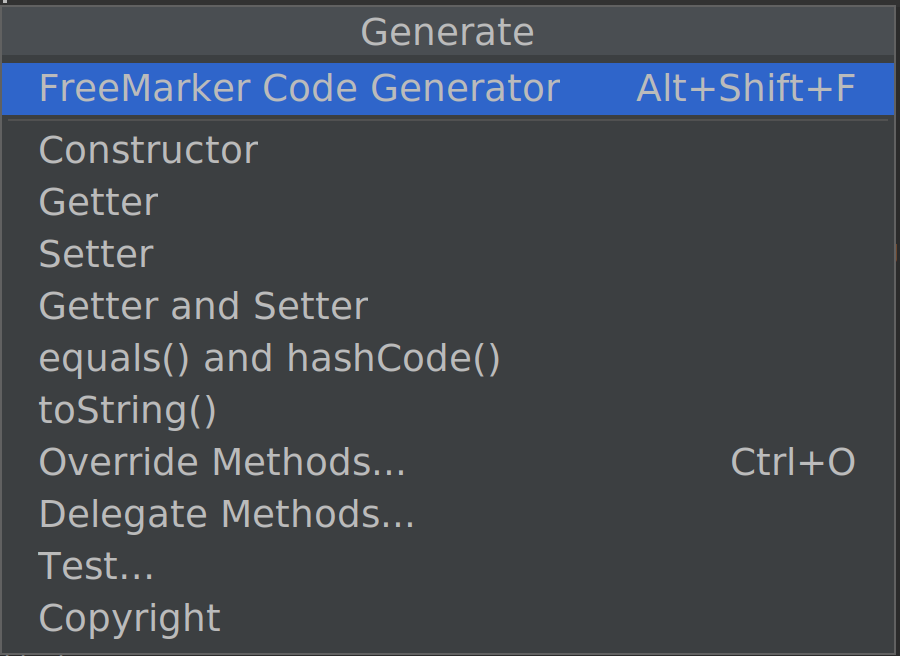

# freemarker-generator-plugin

This Intellij plugin enables you to inject code into 
Java classes via <a href="https://freemarker.apache.org/">FreeMarker templates</a>

Note, this plugin started as a Apache Velocity plugin but because it's not possible 
to reuse the embedded Velocity within a Intellij Plugin we had to use some thing else. 

# Usage

This plugin adds a choice called "FreeMarker Code Generator" 
to the Generate Code dialog (Default shortcut: Alt+Insert).



It will present you with a list of the FreeMarker templates configured (see below).


The default keyboard shortcut for the freemarker generator dialog is `Alt+Shift+F`

# Configuration

Add your FreeMarker templates to the 
`$HOME/.config/freemarker-generator-plugin` 
directory with the `.fm` extension.

The following variables are setup for the code-generator:

| Variable              | Description                                                                                                                                                          |
|-----------------------|----------------------------------------------------------------------------------------------------------------------------------------------------------------------|
| ${class}              | PsiClass reference to the current java class                                                                                                                         |
| ${date}               | current date (java.util.Date instance)                                                                                                                               |
| ${allFields}          | array of fields in the class and all its superclasses.                                                                                                               |
| ${fields}             | array of fields in the class                                                                                                                                         |
| ${javaVersion}        | instance of <a href="https://github.com/JetBrains/intellij-community/blob/master/platform/util/src/com/intellij/util/lang/JavaVersion.java">Intellij JavaVersion</a> | 
| ${javaFeatureVersion} | JavaVersion.feature                                                                                                                                                  |
| ${javaMinorVersion}   | JavaVersion.minor                                                                                                                                                    |                                                                                                                                                   |
| ${javaUpdateVersion}  | JavaVersion.update                                                                                                                                                   |

NOTE: The `${javaFeatureVersion}`, `${javaMinorVersion}` and `${javaUpdateVersion}` 
are separate variables as FreeMarker cannot access public fields.

The instances in `${fields}` and `${allFields}` are collections 
of [`FieldDeclaration`](src/main/java/com/pehrs/intellij/freemarker/plugin/FieldDeclaration.java) 
instances for easier access to field details. 

The `FieldDeclaration` has the following attributes:

| Attribute               | Description |
|-------------------------|-------------|
| ${field.getType()}      | The field type |
| ${field.getName()}      | The field name | 
| ${field.isStatic()}     | true if field is static |
| ${field.isPublic()}     | true if field is public |
| ${field.isProtected()}  | true if field is protected |
| ${field.isPrivate()}    | true if field is private |
| ${field.isArray()}      | true if field is an array |
| ${field.isCollection()} | true if field is a collection (Set or List) |
| ${field.isSet()}        | true if field is a java.util.Set |
| ${field.isList()}       | true if field is a java.util.List |

If you need get the [PsiFields](https://github.com/JetBrains/intellij-community/blob/master/java/java-psi-api/src/com/intellij/psi/PsiField.java) 
for the class, then you can use
`${class.getFields()}` or `${class.getAllFields()}` instead of `${fields}` or `${allFields}`.

## Examples

Here's an example template that generates a merge method:
```freemarker
public void mergeFrom(${class.getName()} from) {
  <#list allFields as field>
    <#if field.isStatic?string('yes','no') == 'no'>
    this.set${field.name?cap_first}(from.get${field.name?cap_first}());
    </#if>
  </#list>
}
```
With a java class like this:

```java
import java.math.BigDecimal;

public class EntitySample {

  private String state;
  private String name;
  private BigDecimal total;

  public String getState() {
    return this.state;
  }

  public String getName() {
    return this.name;
  }

  public BigDecimal getTotal() {
    return this.total;
  }
  
  public void setState(String value) {
    this.state = value;
  }

  public void setName(String value) {
    this.name = value;
  }

  public void setTotal(BigDecimal value) {
    this.total = value;
  }
}
```

The template would generate something like this:
```java
    public void mergeFrom(EntitySample from) {
        this.setState(from.getState());
        this.setName(from.getName());
        this.setTotal(from.getTotal());
    }
```

More examples can be found in the [`examples`](./examples) dir.

# Build

```shell
# Verify (reports will be saved to ./build/reports/pluginVerifier)
./gradlew runPluginVerifier


# Build the distributable zip (./build/distributions/freemarker-generator-plugin-1.0-SNAPSHOT.zip)
./gradlew buildPlugin
```
